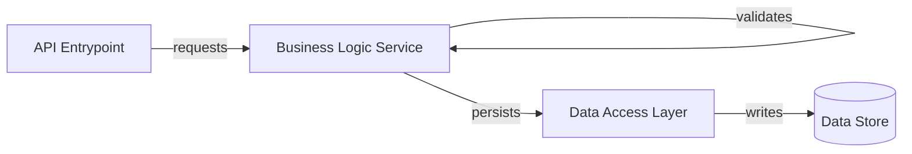

# /visualize - Knowledge Mapping and Dependency Analysis

Create visual representations of system architecture, module dependencies, and knowledge base interconnections. This builds understanding and reveals hidden coupling or gaps.

> **Why visualize?** Complex systems are hard to understand as text. Visualizations expose architecture flaws, coupling patterns, and knowledge structure that remain invisible in documentation.

## When To Use

- Before major architectural decisions
- During onboarding of new team members
- Quarterly architecture reviews
- Before large refactoring initiatives
- To identify module coupling or knowledge gaps

---

## Workflow

### Phase 1: Define Visualization Scope

Choose a visualization type based on your goal:

| Visualization | Shows | Use When |
|---------------|-------|----------|
| **Dependency Graph** | How modules depend on each other | Understanding coupling |
| **Data Flow Diagram** | How data moves through system | Understanding transformations |
| **Knowledge Base Map** | How documentation relates | Knowledge structure review |

### Phase 2: Data Collection

Gather information using standard tools:

```bash
# Example: Find module imports
grep -r "import" {target_dir}

# Example: Find cross-references in docs
grep -r "docs/solutions/" docs/
```

### Phase 3: Create Visualizations (using Mermaid)

Build a Mermaid diagram for your documentation.



### Phase 4: Analysis & Insights

- **Coupling:** Are components too tightly linked?
- **Isolation:** Can pieces be moved or tested independently?
- **Complexity:** Are there "hot spots" with too many dependencies?

---

## Documentation & Sharing

Commit your visualizations to `docs/architecture/` so the team can reference them.

```bash
git add docs/architecture/
git commit -m "docs: add architecture visualizations"
```

---

## Related Workflows

- **Onboarding:** Use `/onboard` to guide others through the maps
- **Refactoring:** Run `/visualize` before and after to show improvement
- **Exploration:** Use `/explore` to deep dive into findings

---

## Instrumentation

```bash
./scripts/log-skill.sh "visualize" "workflow" "$$"
```
