# Antigravity Compound Engineering Plugin


> **Each unit of engineering work should make subsequent units of work easier—not harder.**

A self-improving knowledge system for AI agents that enables compounding engineering capability through persistent learning, systematic workflows, and critical patterns.

## Credits & Inspiration

This project is inspired by and pays tribute to the original **[Compound Engineering Plugin](https://github.com/EveryInc/compound-engineering-plugin)** by [Every Inc](https://github.com/EveryInc). Their pioneering work on persistent learning for Claude Code laid the foundation for this approach.

**Key differences:**
- **Multi-agent support**: Works with Google Gemini, Claude, and other AI agents
- **Extended workflows**: 38 workflows covering the full development lifecycle
- **Observability**: Built-in telemetry, metrics, and health dashboards
- **Modular skills**: Plug-and-play capabilities for different domains

## What is This?

The **Antigravity Compound Engineering Plugin** is a complete framework that transforms AI coding agents from session-to-session amnesiacs into learning partners that compound their capabilities over time. Every bug fixed, every pattern discovered, and every solution documented becomes permanent knowledge that makes future work faster and better.

## Table of Contents

- [Requirements](#requirements)
- [Features](#features)
- [Quick Start](#quick-start)
- [How It Works](#how-it-works)
- [Core Workflows](#core-workflows)
- [Directory Structure](#directory-structure)
- [Health Monitoring](#health-monitoring)
- [Example Skills](#example-skills)
- [FAQ](#faq)
- [Roadmap](#roadmap)
- [Contributing](#contributing)
- [License](#license)
- [Acknowledgments](#acknowledgments)

## Requirements

- **OS**: macOS, Linux, or WSL (Windows Subsystem for Linux)
- **Shell**: Bash 4.0 or higher
- **AI Agent**: Google Gemini, Claude, or any agent supporting `GEMINI.md` configuration
- **Optional**: Git (for version control and workflow automation)

## Features

- 📚 **Knowledge Base** - Searchable solutions with YAML schema validation
- 🔄 **38 Workflows** - From `/plan` to `/compound` to `/housekeeping`
- 🛠️ **50+ Scripts** - Automation for metrics, validation, and telemetry
- 🧠 **10+ Modular Skills** - Session resume, compound docs, file todos, code review, testing, debugging, mobile, security, git, react
- 🎯 **32 Critical Patterns** - Antibodies against recurring mistakes
- 📊 **Health Dashboard** - Daily metrics and compound system vitals

## Quick Start

### 1. Use this template

Click **"Use this template"** on GitHub, or:

```bash
git clone https://github.com/YOUR_USERNAME/antigravity-compound-engineering-plugin.git my-project
cd my-project
```

### 2. Run setup

```bash
chmod +x setup.sh
./setup.sh
```

This will:
- Set executable permissions on all scripts
- Create telemetry directories (`.agent/logs`, `.agent/metrics`)
- Prompt you for your project name and update `GEMINI.md`

### 3. Configure your AI agent

Point your AI agent (e.g., Google Gemini, Claude) to read `GEMINI.md` as its configuration file. This file defines the agent's behavior protocol, workflow bindings, and critical patterns.

### 4. Start compounding

```bash
# Check system health
./scripts/compound-dashboard.sh

# Search for existing solutions before solving problems
./scripts/compound-search.sh "your problem keywords"
```

### 5. Verify success

You should see output like this:

```bash
$ ./scripts/compound-dashboard.sh
📊 Compound System Dashboard
━━━━━━━━━━━━━━━━━━━━━━━━━━━
Solutions: 0 (Building knowledge...)
Patterns: 32 ✓
Workflows: 38 ✓
Health: Good ✓
```

Your compound engineering system is now active! The agent will learn and improve with every task.

## How It Works

The compound system creates a virtuous cycle where each unit of work makes future work easier:

```mermaid
graph LR
    A[🔍 /explore<br/>Research] --> B[📋 /specs or /plan<br/>Design]
    B --> C[⚙️ /work<br/>Implement]
    C --> D[👀 /review<br/>Validate]
    D --> E[📚 /compound<br/>Document]
    E --> F[🧹 /housekeeping<br/>Cleanup]
    F --> A
    E -.-> G[(Knowledge Base)]
    G -.-> A
    style G fill:#f9f,stroke:#333,stroke-width:2px
```



**Key Insight:** Every solved problem feeds the knowledge base, making similar problems trivial in the future.

## Core Workflows

| Command | When | Purpose |
|---------|------|---------|
| `/cycle` | For small complete tasks | Full lifecycle: plan → work → review → compound |
| `/explore` | Before planning | Deep investigation and multi-order analysis |
| `/specs` | For large multi-session work | Requirements, design, and phased task tracking |
| `/plan` | Before significant work | Research and create implementation plans |
| `/work` | During implementation | Execute plans systematically |
| `/review` | Before merging | Quality check with multiple perspectives |
| `/compound` | After solving problems | Capture knowledge for reuse |
| `/route` | Anytime (Unsure?) | Intelligent workflow routing based on intent |
| `/audit-security` | Before/After security work | Proactive threat modeling and code audit |
| `/refactor` | During structure work | Systematic, zero-risk structural improvement |
| `/release` | Before publishing | Unified pipeline for versioning/changelogs/docs |
| `/emergency` | During critical incidents | High-velocity hotfix path for outages |
| `/help` | Anytime | Unified help and discovery for all workflows |
| `/onboard` | Start of session | Establish context and prime the agent |
| `/housekeeping` | Before git push | Archive completed work, fix drift |

See [.agent/workflows/README.md](.agent/workflows/README.md) for complete documentation.

## Directory Structure

```
your-project/
├── .agent/
│   ├── logs/              # Telemetry tracking
│   ├── metrics/           # Health snapshots
│   └── workflows/         # Workflow definitions
├── docs/
│   ├── architecture/      # System architecture
│   ├── decisions/         # Architecture Decision Records
│   ├── explorations/      # Deep research artifacts
│   ├── solutions/         # The Knowledge Base
│   └── specs/             # Multi-session specifications
├── plans/                 # Implementation plans
├── scripts/               # Automation & validation
├── skills/                # Modular agent capabilities
└── todos/                 # Tracked work items
```

## The Compound Loop

```
/explore → /plan → /work → /review → /compound → /housekeeping → repeat
```

Every solved problem becomes a searchable solution in `docs/solutions/` with YAML frontmatter for structured searching.

## Health Monitoring

```bash
# Daily health check
./scripts/compound-dashboard.sh

# Weekly deep health check  
./scripts/compound-health.sh
```

## Example Skills

The `skills/examples/` directory contains specialized skills:
- **Supabase** (`skills/examples/supabase/`): Database migrations, RLS policies, debugging

To activate, move to `skills/` and update `GEMINI.md`.

## FAQ

### Can I use this with Claude or other AI agents?

Yes! Point your AI agent to read `GEMINI.md` as its configuration file. The system works with any agent that can:
- Read markdown configuration files
- Execute shell scripts
- Follow systematic workflows

### How do I add a new skill?

1. See `skills/examples/` for templates
2. Copy to `skills/your-skill-name/`
3. Create a `SKILL.md` following the template structure
4. Update `GEMINI.md` to reference the new skill
5. Add instrumentation: `./scripts/log-skill.sh "your-skill" "usage-context" "$$"`

### What if I want to customize the workflows?

All workflows are markdown files in `.agent/workflows/`. You can:
- Edit existing workflows to match your process
- Create new workflows using `/generate_command`
- Remove workflows you don't need

### How do I migrate this to an existing project?

```bash
# 1. Copy the compound system structure
cp -r antigravity-compound-engineering-plugin/{.agent,docs,scripts,skills,todos} your-project/

# 2. Copy configuration
cp antigravity-compound-engineering-plugin/GEMINI.md your-project/

# 3. Run setup
cd your-project && ./setup.sh
```

### Does this work for non-code projects?

Yes! The compound system works for any knowledge work:
- Documentation projects
- Research and analysis
- Process improvement
- Content creation

Just adapt the workflows and patterns to your domain.

## Roadmap

### In Progress
- [ ] Enhanced pattern detection with AI-assisted categorization
- [ ] Cross-project knowledge sharing (sync solutions across repos)

### Planned
- [ ] VS Code extension for workflow triggers and metrics visualization
- [ ] Web dashboard for compound system analytics
- [ ] GitHub Actions integration for CI validation of compound health
- [ ] Solution recommendation engine (suggest relevant past solutions)
- [ ] Multi-language support for international teams

### Under Consideration
- [ ] Slack/Discord bot for team-wide compound knowledge access
- [ ] Export/import knowledge base between projects
- [ ] Machine learning on solution patterns for predictive debugging

Want to contribute to the roadmap? Open an issue or PR!

## License

MIT License - see [LICENSE](./LICENSE)

## Contributing

See [CONTRIBUTING.md](./CONTRIBUTING.md)

## Acknowledgments

- **[Every Inc](https://github.com/EveryInc)** - For the original [Compound Engineering Plugin](https://github.com/EveryInc/compound-engineering-plugin) that pioneered this approach
- The Antigravity team for extending and adapting the system

---

**Remember**: Each unit of work should make the next one easier. That's compounding.
