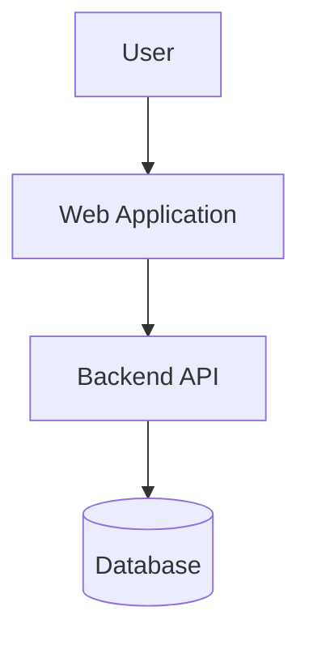

# {PROJECT_NAME} Codebase Map

> **Purpose:** This document serves as the high-level entry point for understanding the system architecture and code organization.

## System Overview

[Provide a high-level description of your system architecture here. e.g. Monorepo, Microservices, Frontend/Backend split, etc.]

## Architecture

## Top-Level Directory Map

| Area | Folder | Purpose |
|------|--------|---------|
| **Source** | [`src/`](../../src/README.md) | Application source code |
| **Scripts** | [`scripts/`](../../scripts/README.md) | Automation and maintenance scripts |
| **Docs** | [`docs/`](../../docs/README.md) | Project documentation and knowledge base |
| **Agent** | [`.agent/`](../../.agent/workflows/README.md) | AI Agent configuration and workflows |

## Detailed Module Maps

[Add detailed maps for your specific modules below]

### 1. Module A

...

### 2. Module B

...
