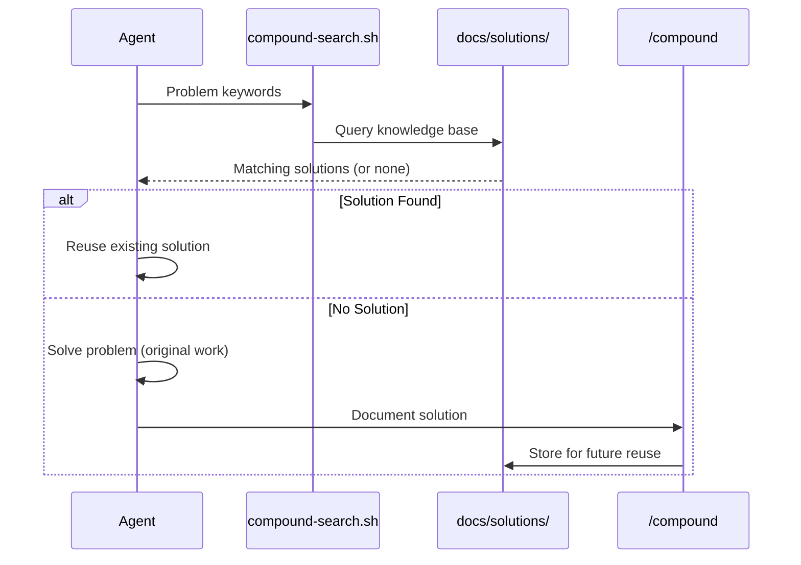
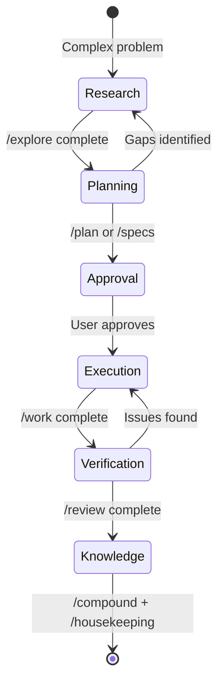
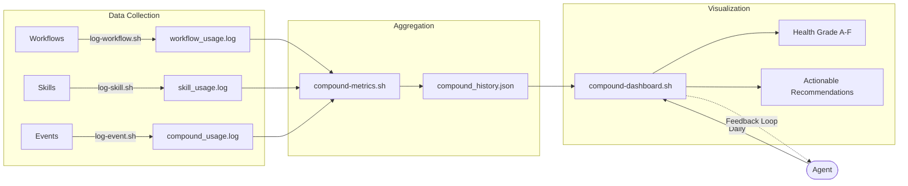

# Compound System Architecture

> **Core Principle:** "Each unit of engineering work should make subsequent units of work easier—not harder."

This document is the **Single Source of Truth** for the Compound System's technical architecture. It maps the skills, workflows, scripts, and patterns that drive the autonomous engineering capability of {PROJECT_NAME} agents.

## The Compounding Philosophy

### Asset vs. Liability Mindset

Every engineering artifact can be classified as an **asset** (makes future work easier) or a **liability** (adds maintenance burden):

| Asset | Liability |
|-------|-----------|
| Reusable solution documented in `docs/solutions/` | One-off fix buried in chat history |
| Automated validation script | Manual checklist |
| Well-enforced pattern | Tribal knowledge |

**The Compound System is designed to maximize assets and minimize liabilities.**

### Why Compounding Works

1. **Search Before Solve**: Agents check `docs/solutions/` before implementing, discovering existing solutions.
2. **Document After Success**: The `/compound` workflow captures new solutions immediately.
3. **Enforce via Automation**: Scripts like `validate-compound.sh` and `pre-push-housekeeping.sh` prevent drift.

**Result:** Each solved problem becomes a 10x multiplier for the next similar problem.

## 0. The Constitution

The primary configuration and behavioral protocol for all agents is defined in:

👉 **[`GEMINI.md`](../../GEMINI.md)**

**This file is the "kernel" of the Compound System.** It controls:
- **Agent Identity & Philosophy**: The compounding mindset
- **Core 12-Point Behavior Protocol**: Systematic execution rules (see Section 5)
- **Mandatory Workflow Bindings**: When to use `/explore`, `/plan`, `/compound`, etc.

**Key Insight:** While `docs/architecture/compound-system.md` (this document) describes *what exists*, `GEMINI.md` describes *how agents should behave*. Together they form a complete specification:
- **Architecture (this doc)**: System structure, components, data flows
- **Constitution (GEMINI.md)**: Agent behavior, decision protocols, priorities

**Enforcement:** `GEMINI.md` is injected into every agent context via user rules, making it impossible for agents to operate without adhering to the protocol.

---

## 1. Skills Reference

Modular capabilities that agents can invoke.

| Skill | Purpose | Entry Point | Usage |
|-------|---------|-------------|-------|
| `session-resume` | Restore context at session start | [`skills/session-resume/SKILL.md`](../../skills/session-resume/SKILL.md) | **Mandatory** (-1) |
| `compound-docs` | Search/document solutions | [`skills/compound-docs/SKILL.md`](../../skills/compound-docs/SKILL.md) | **Mandatory** (Step 0) |
| `file-todos` | Manage file-based tasks/todos | [`skills/file-todos/SKILL.md`](../../skills/file-todos/SKILL.md) | As needed |
| `code-review` | Multi-perspective quality gates | [`skills/code-review/SKILL.md`](../../skills/code-review/SKILL.md) | During `/review` |
| `testing` | Unified test patterns | [`skills/testing/SKILL.md`](../../skills/testing/SKILL.md) | During `/work` |
| `debug` | Structured root cause analysis | [`skills/debug/SKILL.md`](../../skills/debug/SKILL.md) | On failure |

---

## 2. Workflow Reference

Standardized operating procedures for engineering tasks.

### Core Loop
| Command | Purpose | Implicit Trigger Phrases |
|---------|---------|--------------------------|
| `/explore` | Deep investigation (pre-plan) | "I need to understand...", "Let me investigate..." |
| `/specs` | Multi-session initiatives | N/A (Strategic decision) |
| `/plan` | Create implementation plans | Before significant work |
| `/work` | Execute plans systematically | "Proceed", "Go ahead", "LGTM" |
| `/review` | Quality check before merge | "Ship it", "Ready to merge" |
| `/compound` | Capture knowledge | "That worked", "It's fixed" |
| `/housekeeping` | Pre-push cleanup | Before git push |

### Support Workflows
*See [.agent/workflows/README.md](../../.agent/workflows/README.md) for full list.*

- **Planning:** `/plan_review`
- **Triage:** `/triage`, `/resolve_todo`
- **Code Review:** `/resolve_pr`
- **Docs:** `/changelog`, `/release-docs`, `/deploy-docs`
- **Debug:** `/report-bug`, `/reproduce-bug`
- **Maintenance:** `/compound_health`, `/adr`, `/promote_pattern`
- **Extension:** `/create-agent-skill`, `/heal-skill`, `/generate_command`, `/skill-review`
- **Process:** `/triage-sprint`
- **Platform:** `/xcode-test`

---

## 3. Automation Scripts

The nervous system that connects skills and workflows.

| Script | Purpose |
|--------|---------|
| `scripts/compound-search.sh` | Knowledge retrieval engine |
| `scripts/validate-architecture.sh` | **Enforces this document's accuracy** |
| `scripts/validate-compound.sh` | Validates solution YAML & pattern registry |
| `scripts/pre-push-housekeeping.sh` | Git hook for system health |
| `scripts/compound-metrics.sh` | Telemetry aggregation |
| `scripts/compound-dashboard.sh` | Daily health visualization |
| `scripts/audit-state-drift.sh` | Lifecycle consistency check |

---

## 4. Pattern Registry

The "Antibodies" of the system—preventing recurring mistakes.

*Source: [`docs/solutions/patterns/critical-patterns.md`](../../docs/solutions/patterns/critical-patterns.md)*

| # | Pattern | Core Principle |
|---|---------|----------------|
| 1 | Searh Before Solving | Always check existing solutions. |
| ... | ... | (See critical-patterns.md for full list) |

*(Refer to source file for the complete, up-to-date registry)*

---

## 5. Agent Behavior Protocol

-1. **Resume Context:** Run `skills/session-resume/SKILL.md` at start.
0. **Check Specs:** Look for active multi-session initiatives.
1. **Search First:** Use `compound-search.sh` before solving.
2. **Deep Explore:** Use `/explore` for complex problems.
3. **Document:** Run `/compound` after success.
4. **Follow Patterns:** Adhere to `critical-patterns.md`.
5. **Use Workflows:** Formal protocols over ad-hoc work.
6. **Create Todos:** Deferred work must be tracked in `todos/`.
7. **Housekeeping:** Clean up before pushing.
8. **Weekly Health:** Run `./scripts/compound-health.sh` Mondays.
9. **Record ADRs:** Document architectural decisions.
10. **Daily Health:** Run `./scripts/compound-dashboard.sh` daily.
11. **Instrument Skills:** Add telemetry to new skills.

---

## 6. System Architecture: Core Subsystems

The Compound System is built on four interconnected subsystems that work together to enable autonomous engineering.

### 6.1 The Knowledge Engine

**Purpose:** Transform solved problems into reusable assets.

**Mechanism: The Search → Solve → Compound Loop**



**Key Components:**

| Component | Role | Implementation |
|-----------|------|----------------|
| `compound-search.sh` | Knowledge retrieval | Full-text search across `docs/solutions/` |
| `/compound` workflow | Knowledge capture | Structured solution documentation |
| `validate-compound.sh` | Quality gate | YAML schema + pattern validation |
| Solution frontmatter | Metadata index | Enables search by category, date, tags |

**Data Flow:**
1. Agent receives task → runs `compound-search.sh {keywords}`
2. If hit: Agent reads solution, references it, updates `last_referenced` date
3. If miss: Agent solves problem, then documents via `/compound`
4. Solution file created in `docs/solutions/{category}/`
5. Future agents discover the solution via search

**Compounding Metrics:**
- **Hit Rate:** `(Solutions reused / Total problems) × 100%`
- **Zombie Rate:** Solutions not referenced in >90 days
- **Coverage:** Percentage of common problem types documented

---

### 6.2 The Workflow Engine

**Purpose:** Enforce systematic engineering processes.

**Mechanism: State Machine Orchestration**



**Workflow Types:**

| Workflow | Trigger | Output Artifact | Enforces |
|----------|---------|-----------------|----------|
| `/explore` | "I need to understand..." | `docs/explorations/*.md` | Multi-order thinking |
| `/specs` | Multi-week initiatives | `docs/specs/{name}/` | Phased execution |
| `/plan` | Before significant work | `plans/*.md` | Planning rigor |
| `/work` | "Proceed", "LGTM" | Code changes + tests | Test-driven execution |
| `/review` | Before merge | Findings + todos | Multi-perspective review |
| `/compound` | "That worked!" | `docs/solutions/*.md` | Knowledge capture |
| `/housekeeping` | Before `git push` | Clean repo state | Archive completed work |

**Implicit Triggers (Pattern #14):**
The system recognizes natural language phrases and auto-triggers workflows:
- "Let me investigate..." → `/explore`
- "Go ahead" → `/work`
- "Ship it" → `/review` + `/compound`

**Enforcement Mechanisms:**
1. **Git Hooks:** `pre-push-housekeeping.sh` blocks push if todos/plans not archived
2. **Workflow Protocol:** Each workflow calls `log-workflow.sh`, building usage telemetry
3. **Skill Dependencies:** Workflows explicitly call skills (e.g., `/review` → `code-review` skill)

---

### 6.3 The Immune System (Pattern Enforcement)

**Purpose:** Prevent recurring mistakes through codified patterns.

**Mechanism: Multi-Layer Defense**

```mermaid
graph TD
    Problem[Recurring Problem] --> Recognize{Agent Recognizes?}
    Recognize -->|Yes| Pattern[Apply Pattern]
    Recognize -->|No| Mistake[Make Mistake]
    Mistake --> Review[/review detects]
    Review --> Document["/compound documents"]
    Document --> Promote{Recurring?}
    Promote -->|Yes| Critical["Add to critical-patterns.md"]
    Promote -->|No| Solution["Store in docs/solutions/"]
    Critical --> Enforce[Validation Script]
    Solution --> Search["Future compound-search"]
    
    Pattern --> Validate[Validation Script]
    Validate -->|Pass| Ship[Ship Code]
    Validate -->|Fail| Block[Block Push]
```

**Pattern Layers:**

| Layer | Mechanism | Example |
|-------|-----------|---------|
| **Level 1: Documentation** | `critical-patterns.md` | Pattern #10: Use scripts, not manual edits |
| **Level 2: Workflow Integration** | Checklists in workflows | `/work` Step 3.5: "Run `/doc`" |
| **Level 3: Validation Scripts** | Automated checks | `validate-compound.sh` checks YAML schema |
| **Level 4: Git Hooks** | Pre-push enforcement | `pre-push-housekeeping.sh` blocks stale docs |

**Pattern Lifecycle:**
1. **Problem occurs** → Solved and documented in `/compound`
2. **Problem recurs** → Recognized during `/review`
3. **Promotion trigger** → Run `/promote_pattern`
4. **Critical pattern added** → Updated in `critical-patterns.md`
5. **Validation script created** → Automated enforcement
6. **Git hook integrated** → Impossible to violate

**Current Pattern Count:** 23 critical patterns (see Section 4)

---

### 6.4 The Nervous System (Metrics & Feedback)

**Purpose:** Provide real-time visibility into system health.

**Mechanism: Instrumentation + Aggregation + Visualization**



**Telemetry Files:**

| File | Writer | Purpose |
|------|--------|---------|
| `.agent/logs/workflow_usage.log` | `log-workflow.sh` | Tracks every `/workflow` invocation |
| `.agent/logs/skill_usage.log` | `log-skill.sh` | Tracks skill usage by context |
| `.agent/logs/compound_usage.log` | Various | General system events |
| `.agent/metrics/compound_history.json` | `compound-metrics.sh` | Daily health snapshots |
| `.agent/metrics/unused_workflows.txt` | `compound-dashboard.sh` | Identifies stale workflows |

**Health Dashboard Metrics:**

| Metric | Formula | Target |
|--------|---------|--------|
| **Solution Count** | Files in `docs/solutions/` | Growing |
| **Hit Rate** | Solutions with `last_referenced` < 90 days | >50% |
| **Zombie Rate** | Solutions not referenced in >90 days | <20% |
| **Todo Debt** | Pending todos in `todos/` | <10 P1 items |
| **Drift** | Stale specs/plans | 0 |

**Feedback Loops:**
1. **Daily Health Check** → Agent runs `compound-dashboard.sh` at session start
2. **Warnings displayed** → Agent addresses recommendations (e.g., "Link orphaned solutions")
3. **Metrics improve** → Health grade increases (F → D → C → B → A)
4. **Continuous improvement** → System learns from its own usage patterns

**Observability by Default (Pattern #13):**
Every new skill MUST include instrumentation calling `log-skill.sh` to participate in the feedback loop.

---

## 7. Component Map

```mermaid
graph TD
    User([User]) --> |"Start Session"| Resume[session-resume]
    Resume --> Dashboard[compound-dashboard]
    
    subgraph "Core Workflow Loop"
        Explore[/explore] --> Plan[/plan]
        Plan --> Work[/work]
        Work --> Review[/review]
        Review --> Compound[/compound]
        Compound --> Housekeeping[/housekeeping]
    end
    
    subgraph "Knowledge Base"
        Solutions[(docs/solutions)]
        Patterns[(critical-patterns)]
        Architecture[(This Document)]
    end
    
    subgraph "Automation"
        Metrics[compound-metrics]
        Validation[validate-architecture]
        Search[compound-search]
    end
    
    User --> Explore
    Work --> |"Uses"| Search
    Search --> |"Reads"| Solutions
    Validation --> |"Verifies"| Architecture
    Housekeeping --> |"Runs"| Validation
    Compound --> |"Writes"| Solutions
```

---

## 8. Metrics & Health

The system monitors its own health via `scripts/compound-metrics.sh`, tracking:
- **Solution Hit Rate:** How often we reuse knowledge.
- **Todo Quality:** Completeness of task definitions.
- **Drift:** Stale plans or specifications.
- **Zombies:** Solutions not referenced in >90 days.

Current status is viewable via `./scripts/compound-dashboard.sh`.

---

## 9. Observability & Feedback

The "Nervous System" tracking autonomous behavior.

### Telemetry Logs (`.agent/logs/`)
| File | Purpose | Writer source |
|------|---------|---------------|
| `workflow_usage.log` | Tracks every workflow invocation | `log-workflow.sh` |
| `skill_usage.log` | Tracks every skill invocation | `log-skill.sh` |
| `compound_usage.log` | General system events | Various scripts |
| `skill_suggestions.csv` | Potential new skills discovered | `suggest-skills.sh` |

### Aggregated Metrics (`.agent/metrics/`)
| File | Purpose | Writer source |
|------|---------|---------------|
| `compound_history.json` | Daily health snapshots | `compound-metrics.sh` |
| `unused_workflows.txt` | Rarely-used workflows | `compound-dashboard.sh` |

---

## 10. Directory Structure

The physical layout of the Compound System.

```
.agent/
├── logs/             # Telemetry data
├── metrics/          # Aggregated health data
└── workflows/        # Executable workflow definitions (*.md)

docs/
├── architecture/     # System-level documentation (You are here)
├── decisions/        # Architecture Decision Records (ADRs)
├── explorations/     # Deep dive research artifacts
├── features/         # Feature documentation
├── solutions/        # The Knowledge Base
│   ├── patterns/     # Critical Patterns
│   ├── templates/    # Artifact templates
│   └── {category}/   # Problem-solution pairs
└── specs/            # Multi-session specifications

plans/                # Implementation plans from /plan
todos/                # Work items from /review
scripts/              # Automation tools
skills/               # Modular agent capabilities
```

---

## 11. Lifecycle Artifacts

The system produces specific artifacts at each stage of the engineering lifecycle.

| Stage | Artifact | Directory |
|-------|----------|-----------|
| **Research** | Exploration Doc | `docs/explorations/` |
| **Strategy** | Specification | `docs/specs/` |
| **Planning** | Implementation Plan | `plans/` |
| **Decision** | ADR | `docs/decisions/` |
| **Execution** | Todo File | `todos/` |
| **Knowledge** | Solution Doc | `docs/solutions/` |
| **Feature** | Feature Doc | `docs/features/` |
